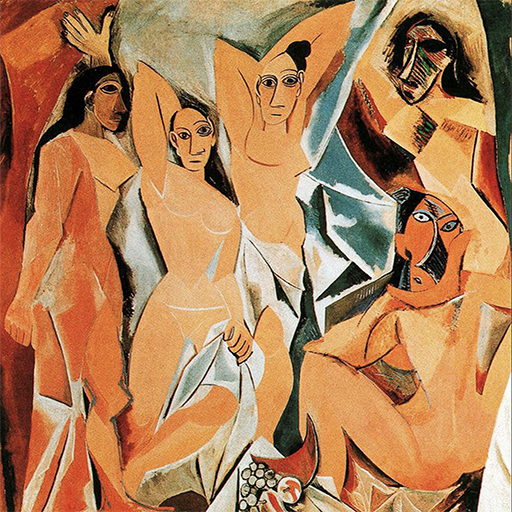
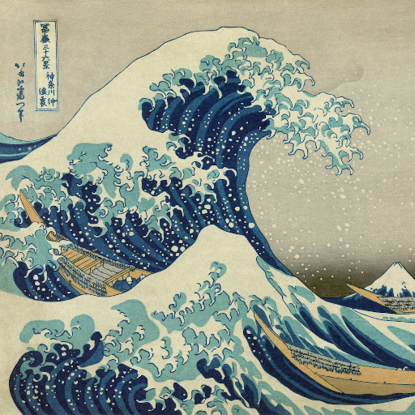
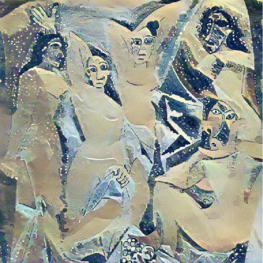

# ECE285_Style_Transfer


### Description
This is ECE 285 final project Style Transfer developed by team Learning Machine composed of Bowen Zhao, Bolin HE, Kunpeng Liu.

### Requirements

install the package as fllow:
```
 $ pip3 install torch torchvision  
```
The origin style transfer also needs to download VGG19 network  
  
  
  
Neural Style Transfer
===========
This is the version based on Gatys paper Style Transfer, it has tested on the UCSD DSMLP.
The code locates in Origin folder.

### Code organization

[demo.ipynb](https://github.com/Soolizo/ECE285_Style-Transfer/blob/master/Origin/Demo.ipynb) -- Run a demo of our code and showing different alpha/beta ratio's effect on the output image.  
[image.py](https://github.com/Soolizo/ECE285_Style-Transfer/blob/master/Origin/image.py) -- Contains the function that used to load and show image.  
[loss.py](https://github.com/Soolizo/ECE285_Style-Transfer/blob/master/Origin/loss.py) -- Contains the function to calculate the content loss, gram martix, style loss.  
[model.py](https://github.com/Soolizo/ECE285_Style-Transfer/blob/master/Origin/model.py) -- Contains the VGG19 network and record the layer that need to calculate content loss and style loss.  
[run.py](https://github.com/Soolizo/ECE285_Style-Transfer/blob/master/Origin/run.py) -- Contains the function with the initialization and how to compute the loss and optimize them.  
  

### Example
We use the content image from one of Picasso's master work, and style image from Kanagawa. Here is the output with α/β ratio equals to 10<sup>8</sup>(α is weight of style loss, β is weight of content loss).

<div align=center />



</div>

  
Image-to-Image Translation using Cycle-GANs
===========


### Code organization


### Example

